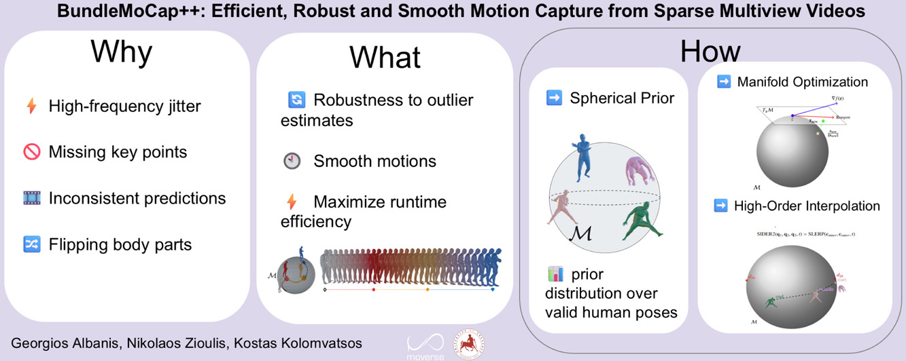

{}
Click the ***Cite*** button above to copy/download publication metadata (*.bib).
{}

<!-- 
{}
Create your slides in Markdown - click the *Slides* button to check out the example.
{}

Supplementary notes can be added here, including [code, math, and images](https://wowchemy.com/docs/writing-markdown-latex/). 
-->
