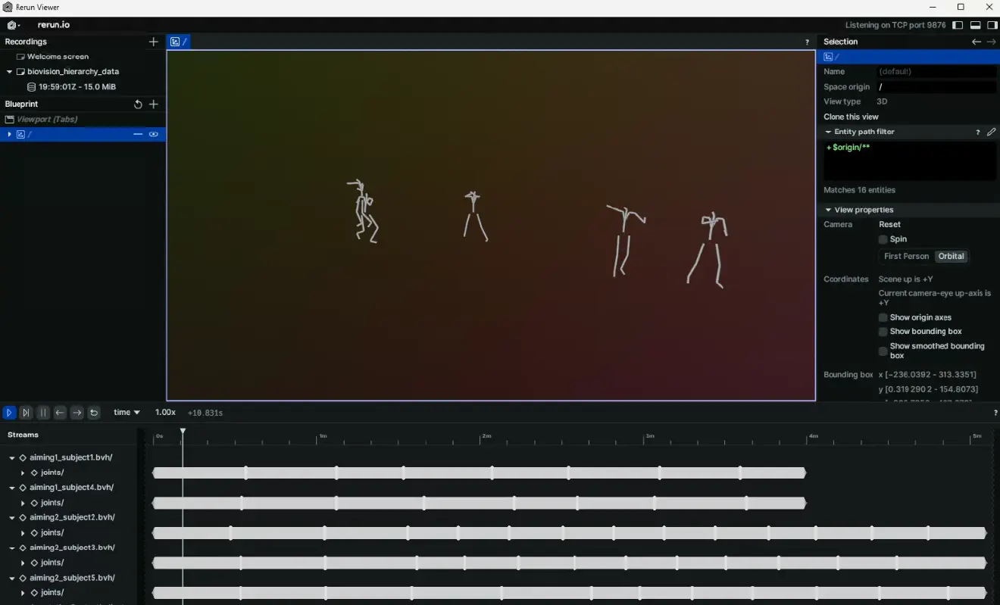

## Features & Design Goals
With the rerun-animation ➿ package users can:

- install a rerun-loader-plugin to drag-n-drop 3D animation files in the rerun-viewer.
- execute commands to log 3D animation data to a rerun instance.

rerun-animation supports the following types of 3D animation data:

- Biovision Hierarchy files (*.bvh)
- Parametric Human Body parameter files (*.npz) from 

<!--more-->
